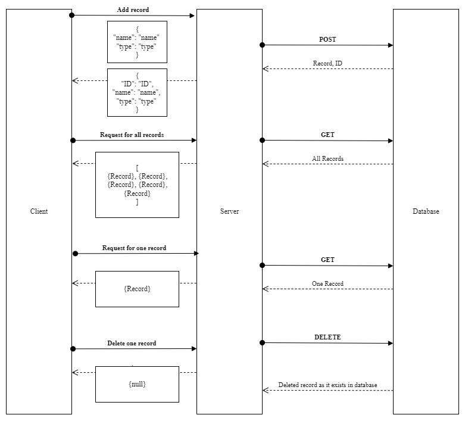

# LAB - Class 03

## Project: Basic API Server

### Author: Brady Davenport

### Problem Domain

Build a REST API using Express, by creating a proper series of endpoints that perform CRUD operations on a database, using the REST standard

#### SQL Models

* 2 SQL data models using `Sequelize` library
* Data types of user choice (person, animal, car, etc)

#### Routes

* POST
* GET - all
* GET - one
* PUT
* DELETE

### Links and Resources

* [Prod url](https://bradyd-basic-api-server.herokuapp.com/)
* [GitHub Repo](https://github.com/bradydavenport/basic-api-server)

### Setup

#### `.env` requirements

* `PORT` - Port Number
* `DATABASE_URL` = `postgres://localhost:5432/<database>`

#### How to initialize/run the application

* `nodemon` to start

* Endpoints:

#### How to use the library

#### Features / Routes

#### Tests

#### UML

(Created with [Diagrams](https://app.diagrams.net/))

